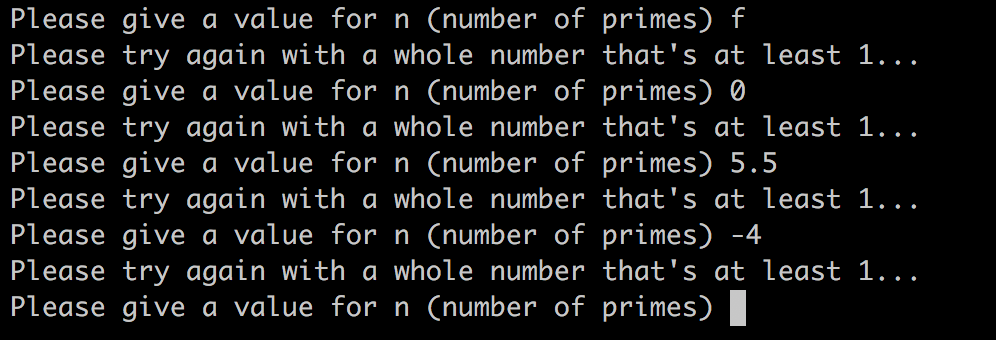
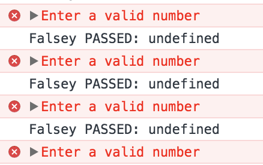

# Prime Multiplication Table Generator


### What is it?

This command line program prompts the user for how many primes they want in the table, the user has to input a whole number N, where is N is at least 1. The app will then calculate the first N primes, then generate and log to the console the resulting multiplication table.

### User Stories

As a user, to help me improve my maths skills, I want to be able to see a multiplication table of prime numbers.

As a user, so that I choose the number of primes shown, I want to be able to enter this information.

As a user, so that the returned data is easy to read, I want it a nice, neat table clearly showing the data.

### Installation and Running

Open up terminal, change to the directory you want the repo and type ```git clone https://github.com/w-schwier/find_my_past```

Change into the directory using: ```cd find_my_past```

To run this application you will need node installed on your machine; if you don't, you can find instructions [here](https://nodejs.org/en/download/package-manager/#macos).

Next type ```npm install```

In the command line, run the app by typing ```node index.js```

You will then be prompted to enter a value for N, number of primes: enter a whole number that's at least 1.

If you fail to enter a valid value for N you will be prompted to enter another value:



N.b To exit out the program you can press ```control``` + ```c```

Tests can be run/viewed by visiting the path of the specRunner.html in a browser, then open the console in the developers tools, this can be done by holding ```option``` + ```command```+ ```i```. E.g. /Users/name/path/to/file/find_my_past/SpecRunner.html

### My Approach

All the above was achieved using TDD to structure the code.

### Challenges and Success

When checking my prime checker function returned false for zero and negative numbers, I realised this was not the case. To over come this problem I was going to implement my inputValidator module and throw an error if the number entered was zero or less, however, to make the app work in the console I had to require the files like in the index, but this stopped the tests working. This was something that I overcame by using the same check code used in inputValidator. Given more time time is something I would like to make neater. Using the inputValidator class as this is its very purpose and there is repeated code which goes against agile methodology.

Also due to the fact I'm using a testing library I wrote, there was not a test to check if an error had been thrown. This meant that there are no tests for these edge cases throwing an error, but there are guard clauses which have been tested in person and return false. When running the tests you can see the alerts in the console window. There are a few solutions to this problem. One is implementing another framework such as Jasmine, another is writing a test that checked for alerts.



Although the prime number generator can work beyond 20,000 numbers, the table generator can only handle 6,000 slowly. Another limitation is logging to the console as it only displays the table in a nice format up to a very small size.

### Future Improvements

The console severely limits the size you can print a nicely formatted table. To address this the table could be either written to a document or onto a webpage. I also believe running the app in the console limits the memory, this coupled with the power of Chromes' V8 engine would increase speed and capability of the program. In future I would like to add a front-end to the application for user input and showing of the table.
