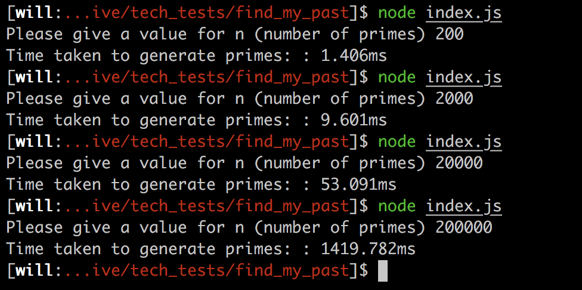

# Prime Multiplication Table Generator


### What is it?

This command line program prompts the user for how many primes they want in the table, the user has to input a whole number N, where is N is at least 1. The app will then calculate the first N primes, then generate and log to the console the resulting multiplication table.

### User Stories

As a user, to help me improve my maths skills, I want to be able to see a multiplication table of prime numbers.

As a user, so that I choose the number of primes shown, I want to be able to enter this information.

As a user, so that the returned data is easy to read, I want it a nice, neat table clearly showing the data.

### Installation and Running

Open up terminal, change to the directory you want the repo and type ```git clone https://github.com/w-schwier/find_my_past```

Change into the directory using: ```cd find_my_past```

To run this application you will need node installed on your machine; if you don't, you can find instructions [here](https://nodejs.org/en/download/package-manager/#macos).

Next type ```npm install```

In the command line, run the app by typing ```node index.js```

You will then be prompted to enter a value for N, number of primes: enter a whole number that's at least 1.

If you fail to enter a valid value for N you will be prompted to enter another value:


N.b To exit out the program you can press ```control``` + ```c```

Tests can be run/viewed by visiting the path of the specRunner.html in a browser, then open the console in the developers tools, this can be done by holding ```option``` + ```command```+ ```i```. E.g. /Users/name/path/to/file/find_my_past/SpecRunner.html

### My Approach

When I was first given this task, I started by breaking it down into its core components. What individually needed to happen to achieve the task. The first thing that needed to happen was the ability to generate primes up to a set point; without this, there would be no way to continue. Having achieved that I moved onto getting an input from the user. I used readline to get this information from the console. In order to make sure the input was valid, it's passed through inputValidator. Having got both lots of data, the multiples can then be calculated. Passing this information into tableGenerator returns a nicely formatted table.

PrimeGenerator: This will take a number, n, and generate the first n primes. It also has another function that is called to check if a number is prime. This function uses a mathematical algorithm called the sieve of Eratosthenes. It works by marking all multiples of a prime as not prime. This means it can quickly collect the numbers remaining. This method selects 1, but not 2. My understanding is that 1 is a unique number, while 2 is a prime. In order to correct this I started the iterations at 2 and the array with 2 pre-existing. This is not the best way, but the other option I considered involved if statements which could of got messy.

InputValidator: This checks the input given is a whole number, that's at least 1.

ArrayMultiplier: Given an array of numbers, it will return a two dimensional array of the multiples.

TableGenerator: Given an array of headers and data, it will generate and return a well formatted table displaying the data. I initially had one monster function that basically did everything the whole class does now. I used TDD to make the main structure of the function, then I spiked to fine tune the table to how I wanted it to look. After refactoring to lots of smaller functions I didn't write tests for each new function. This is because the test for makeTable would tell me if I had broken something, so it was just a matter of retracing my footsteps. Also the test coverage would remain unchanged as they are being tested implicitly through the make table test. This is something that could be developed though.

Index: This is where all of the above is combined. It calls all the necessary functions at the right time to build the table in the desired manner. There are two execute functions so a user can quickly change one function to time the process.

All the above was achieved using TDD to structure the code.

### Challenges and Success

When checking edge cases in my prime checker function, I wanted false to be returned for zero and negative numbers, I realised this was not the case. To over come this problem I was going to implement my inputValidator module and throw an error if the number entered was zero or less, however, to make the app work in the console I had to require the files like in the index, but this stopped the tests working. This was something that I overcame by using the same check code used in inputValidator. Given more time time is something I would like to make neater. Using the inputValidator class as this is its very purpose and there is repeated code which goes against agile methodology. I was worried that checking ever value would slow down the process massively, but as you can see below, speed wasn't too badly affected.

Without checking: 

With checking: 

Also due to the fact I'm using a testing library I wrote, there was not a test to check if an error had been thrown. This meant that there are no tests for these edge cases throwing an error, but there are guard clauses which have been tested in person and return false. When running the tests you can see the alerts in the console window. There are a few solutions to this problem. One is implementing another framework such as Jasmine, another is writing a test that checked for alerts.


Although the prime number generator can work beyond 20,000 numbers, the table generator can only handle between 4,000-5,000 slowly. Another limitation is logging to the console as it only displays the table in a nice format up to a very small size.


I was happy with my refactoring. Before I started breaking the code down I had the tableGenerator making the table and multiplying the data. I was able to take a step back and realise the class was doing too many tasks. I also had a monster function for making the table. This has now been broken down into further functions. Many of the functions intertwine and you almost get a ladder effect, this is something I'm not sure is best practice and could potentially be improved. There are a few if statements in tableGenerator that I tried to use turnery operators for, however, it didn't allow me to call functions from inside. This is something I'd have to look into more to see if it's possible.


The formatting for the table looks quite sexy if I do say so myself. It should scale to any size, the only limitation is the screen size. This is achieved in lines 56-58 below. This calculates the total spaces to be added on either side and splits them accordingly. This ensures the number is always in the middle of the cell.


### Future Improvements

The console severely limits the size you can print a nicely formatted table. To address this the table could be either written to a document or onto a webpage. I also believe running the app in the console limits the memory, this coupled with the power of Chromes' V8 engine would increase speed and capability of the program. In future I would like to add a front-end to the application for user input and showing of the table.

I would also like to improve the efficiency of the tableGenerator class. Although the task was to make sure the primeGenerator could perform at speeds for 20,000+ primes, not the tableGenerator, I feel that the lack of speed and large memory usage hinders the overall app.

Index has no tests at the moment. The main reason for this is that I'm unsure how to stub users entering data into the console.
